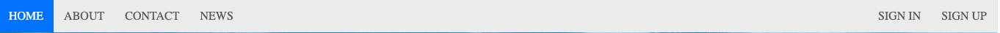
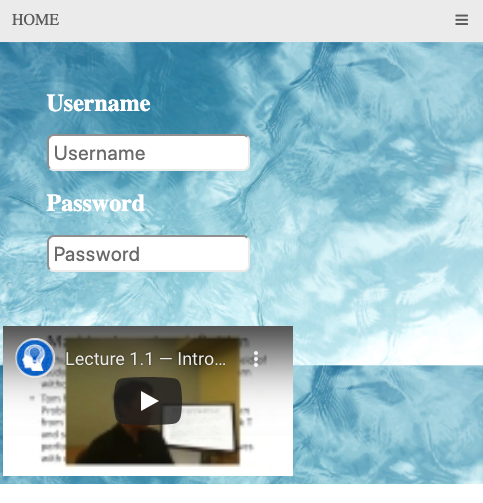
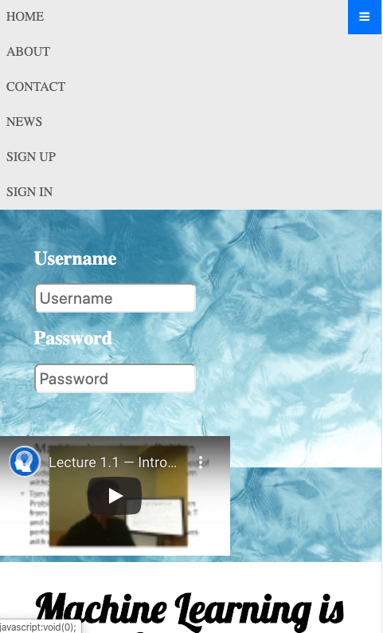
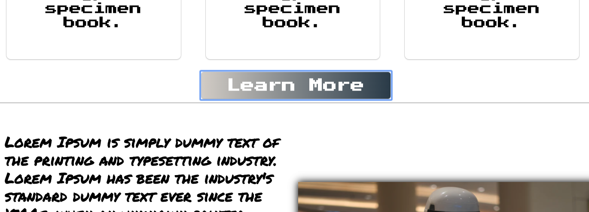
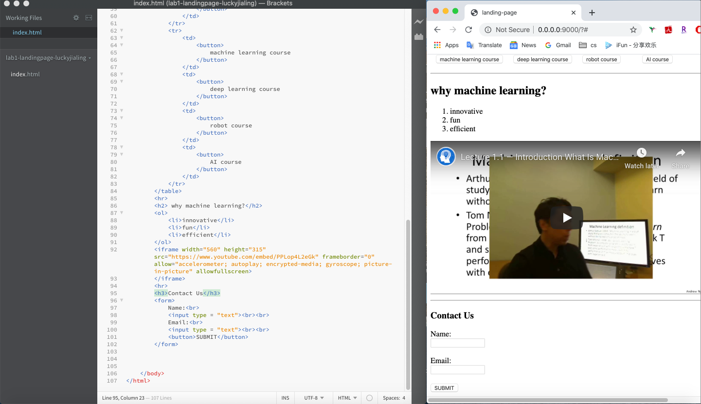
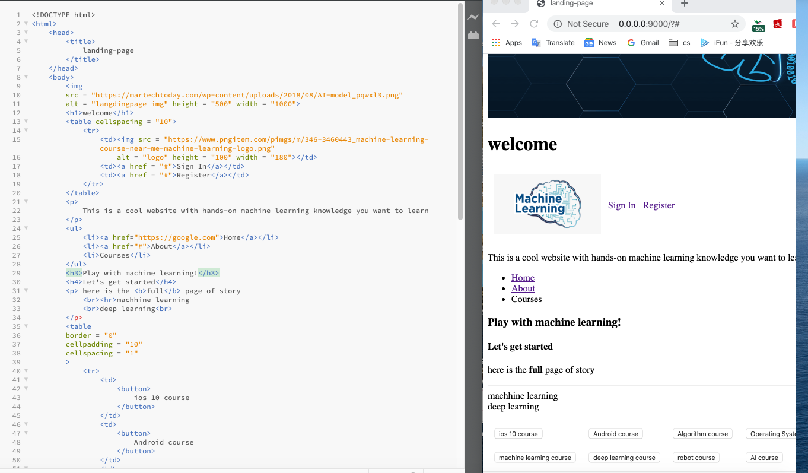

# My Landing Page

This landing page is mainly inspired by and adapted from udemy full-stack course. The web link is: https://www.udemy.com/course/ultimate-web/learn/lecture/7354608?start=45#overview

In my landing page. It includes the navbar, an introduction part with user input(username and password) and a video, 3 blocks including icon and text(further can be extended as different pages), a footer contains links and icons.

I didn't write the text content. All paragraphs' content are the same and I copied them from Lorem Ipsum(https://www.lipsum.com/),which has no meanings.

## 1. Description of the NavBar
- When you click the navbar, the font turned from dark grey to white and the background turned to blue.

- when you shrink the window, the navbar would only show the **HOME** and the *hamburger icon*. 
  

- if you click the *hamburger* menu, it will list all the disappeared item. And if you click it again, the list will not show.
  

## 2. Description of the main page

- As you can see, I used a lot of **flexbox** in this landing page. All the material are listed in different columns and they can easily be transfered to different size without losing text or picture. 
- I tried different **google fonts** in this landing page.  Background image is only applied on the beginning part. 
- I tried to make the **click button** has some special effect. The background of the button is gradient color. When you click the button, there would be an emphasize effect.
  
  

- I also used some border effect on the columns and some shadow effect with the picture in the landding page. I know they are some kind "ugly" and not show my highest artist taste(sth I need to cultivate by time). But at least I tried for this lab assignment :P
  
## 3. Description of the Footer
- I tried those fantastic icons here and made them clickable. flexbox is also used here to make the columns shown. I also used gradient CSS to make the background color more fancy-looking here :))

  

## A quick note of the checkpoint
- In the checkpoint, I only write the html and some content has been altered when I later dress it with CSS.
- OK. get ready for my html prototype?...
  
  
  

  Not too bad, right?

**Thank you for reading me:))**
